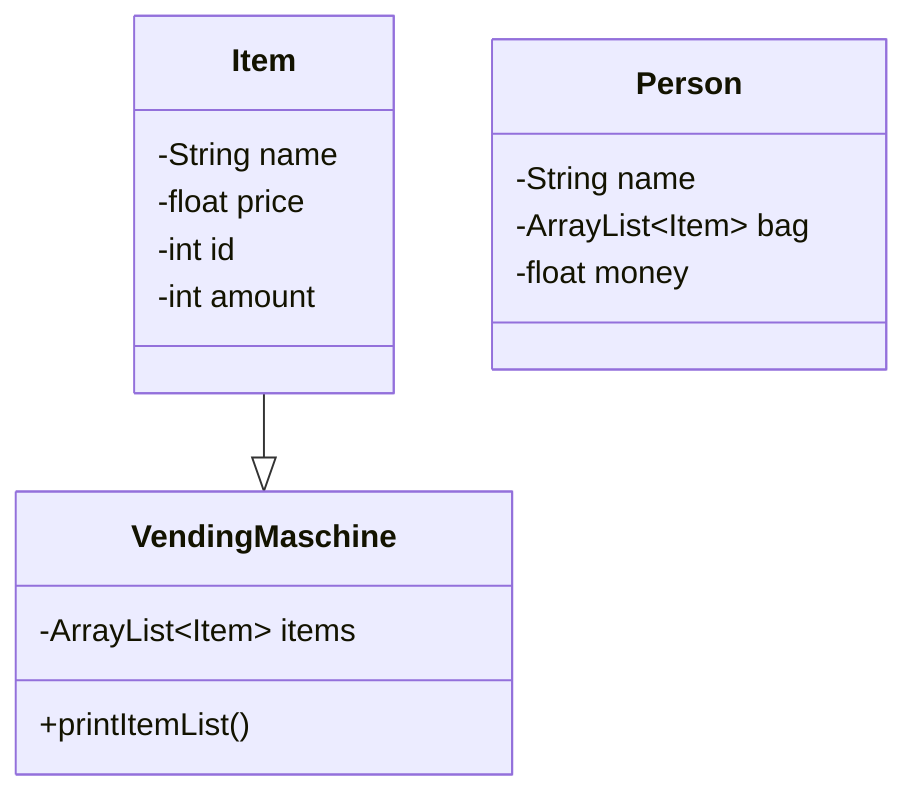

# Snack-Automat

## UML

- \+ > public
- \- > private

```mermaid
    classDiagram
    class VendingMaschine{
        -ArrayList~Item~ items
        +printItemList()
    }

    class Item {
        -String name
        -float price
        -int id
        -int amount
    }

    class Person {
        -String name
        -ArrayList~Item~ bag
        -float money
    }

    Item --|>VendingMaschine
```
