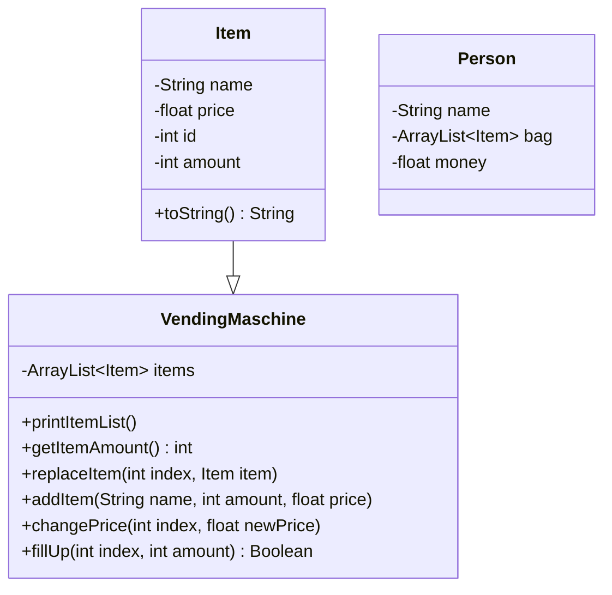

# Snack-Automat

## UML

- \+ > public
- \- > private

Getters & Setters are not displayed

```mermaid
    classDiagram
    class VendingMaschine{
        -ArrayList~Item~ items
        +printItemList()
        +getItemAmount() int
        +replaceItem(int index, Item item)
        +addItem(String name, int amount, float price)
        +changePrice(int index, float newPrice)
        +fillUp(int index, int amount) Boolean
    }

    class Item {
        -String name
        -float price
        -int id
        -int amount
        +toString() String
    }

    class Person {
        -String name
        -ArrayList~Item~ bag
        -float money
    }

    Item --|>VendingMaschine
```
