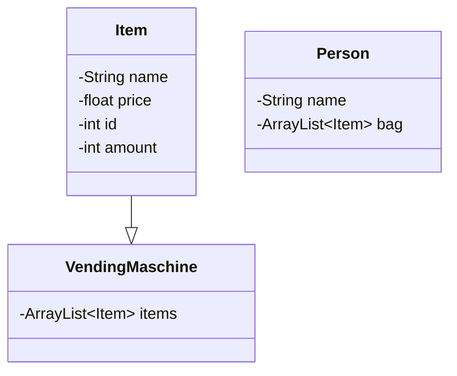

# Snack-Automat

## UML

```mermaid
    classDiagram
    class VendingMaschine{
        -ArrayList~Item~ items
        
    }

    class Item {
        -String name
        -float price
        -int id
        -int amount
    }

    class Person {
        -String name
        -ArrayList~Item~ bag
    }

    Item --|>VendingMaschine
```
